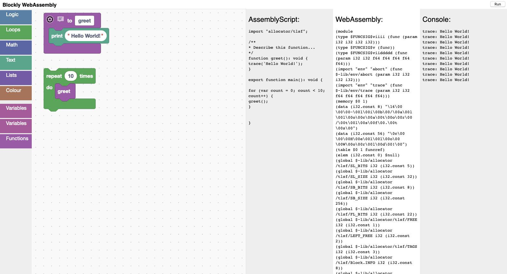

# blockly-wasm

An experiment to make a WASM backend for Blockly using Nativescript as an intermediate language. I never finished it, but the code is here if anyone wants to continue where I left off.

